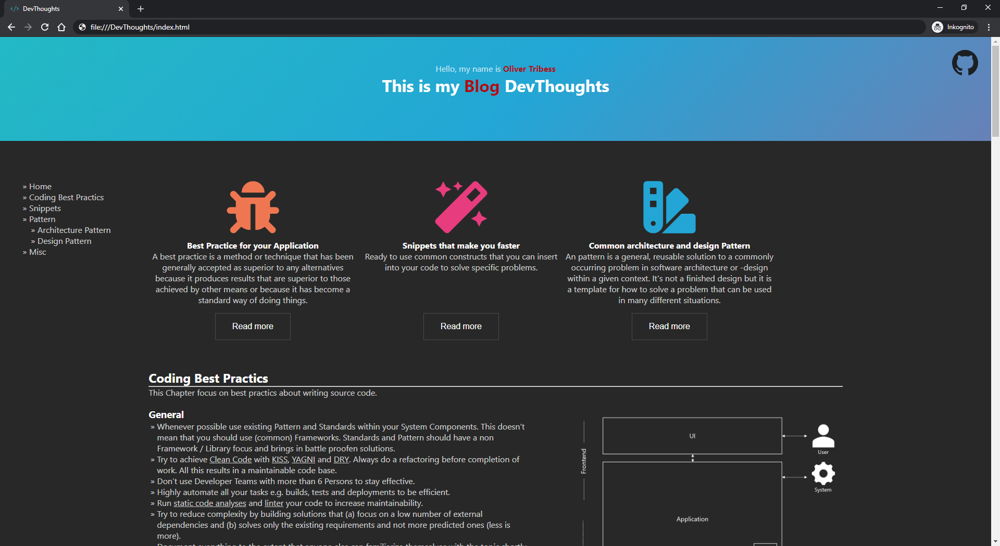

# DevThoughts
[](https://github.com/Tait1337/DevThoughts/actions)
[](https://sonarcloud.io/dashboard?id=Tait1337_DevThoughts)
[](LICENSE)

Technical Blog with Infos, Best Practices and Ideas about Application Frameworks, Libs and Architecture.

## Getting Started

These instructions will get you a copy of the project up and running on your local machine for development and testing purposes. See deployment for notes on how to deploy the project on a live system.

### Prerequisites

No Prerequisites.

### Installing

Clone the Repository.
```
git clone https://github.com/tait1337/DevThoughts.git
```

Navigate to ./Index.html.



### Configuration

No Configuration exist.

## Running the tests

No Tests exist.

## Deployment

The most basic option to open the Webpage is by copying all files to the target system with pre-installed Web Server and serve it from there.

In addition to that you can build the Application as Dockerimage with included Web Server.

### Built and run as Dockerimage with nginx Web Server

```
./docker build -t devthoughts:latest .
./docker run --env-file .env -p 80:80 -d devthoughts:latest
```

## Contributing

I encourage all the developers out there to contribute to the repository and help me to update or expand it.

To contribute just create an issue together with the pull request that contains your features or fixes.

## Versioning

We use [GitHub](https://github.com) for versioning. For the versions available, see the [tags on this repository](https://github.com/tait1337/DevThoughts/tags). 

## Authors

* **Oliver Tribess** - *Initial work* - [tait1337](https://github.com/tait1337)

## License

This project is licensed under the Apache License 2.0 - see the [LICENSE.md](LICENSE) file for details

## Acknowledgments

* [Fontawesome](https://fontawesome.com) for providing icons
* [GitHub Gist](https://gist.github.com) for hosting the all code snippets